Aplicações
=============================

## 
 Quantização 
 

Antes             |  Depois
:-------------------------:|:-------------------------:
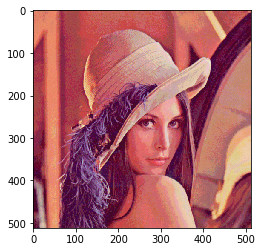 |  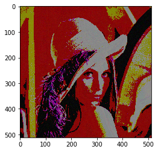

## 
 Filtros Espaciais 
 

Antes             |  Edges
:-------------------------:|:-------------------------:
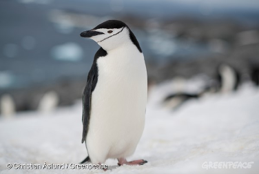 |  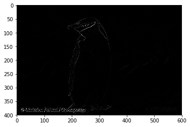 

Sharpening             |  Ruído
:-------------------------:|:-------------------------:
 |  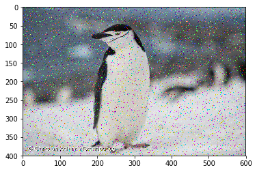 

Median Blur             |  
:-------------------------:|
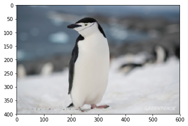 |  

Histograma de Cores         |  
:-------------------------:|
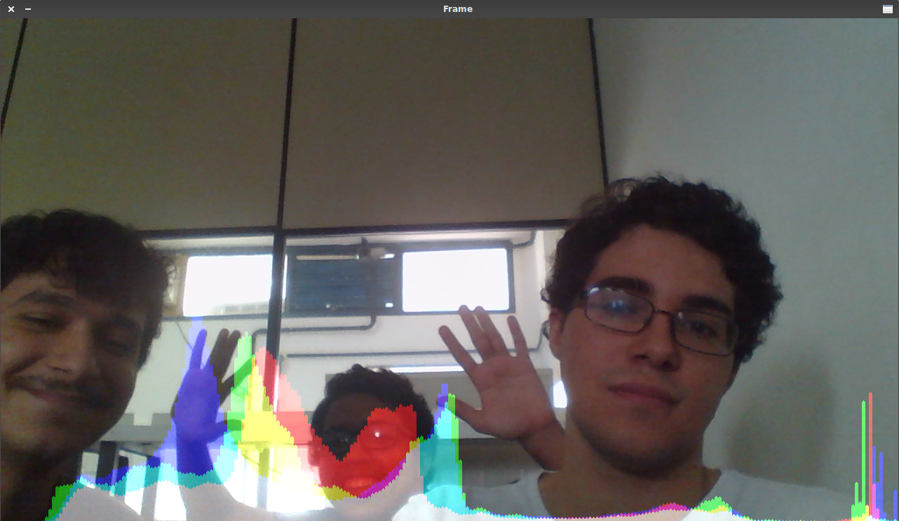 |  

Original             |  Canny Edge Detector
:-------------------------:|:-------------------------:
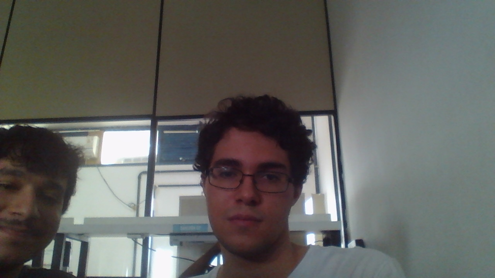 |  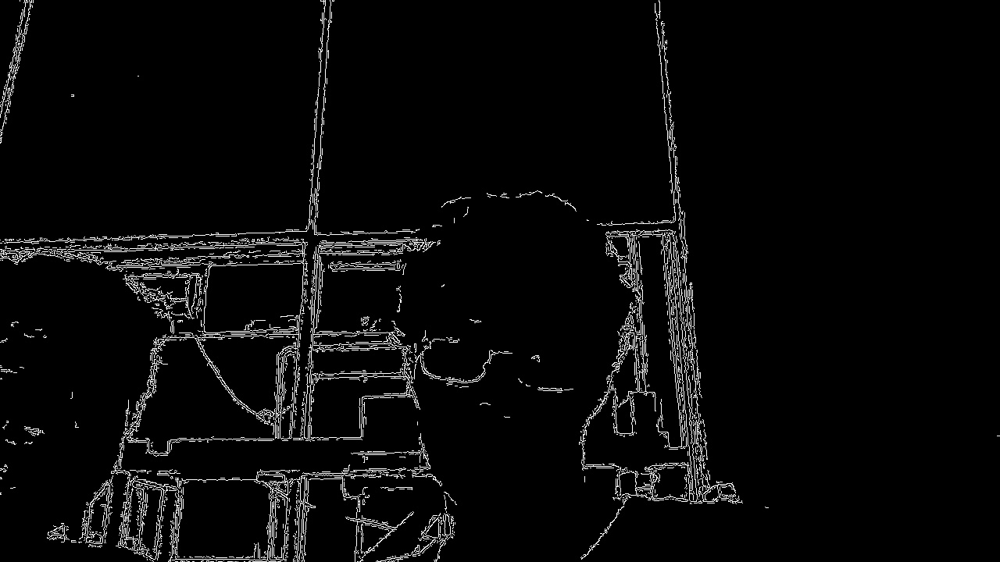 

Original             |  Threshold
:-------------------------:|:-------------------------:
 |  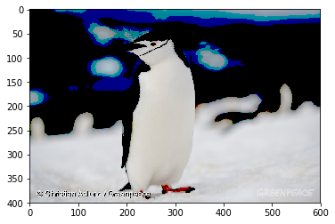 

Original             |  Segmentation
:-------------------------:|:-------------------------:
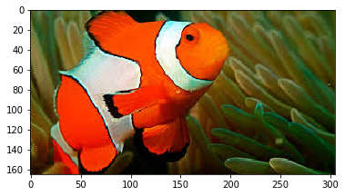 |  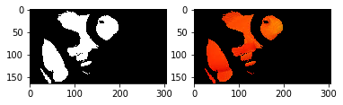 

Original             |  Segmentation
:-------------------------:|:-------------------------:
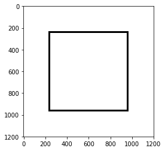 |  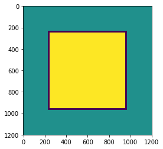 

##  
 Projeto 0: Simulador Robô Seguidor de Linha 

Versão Inicial | Com Timer 
:-------------------------:|:-------------------------:
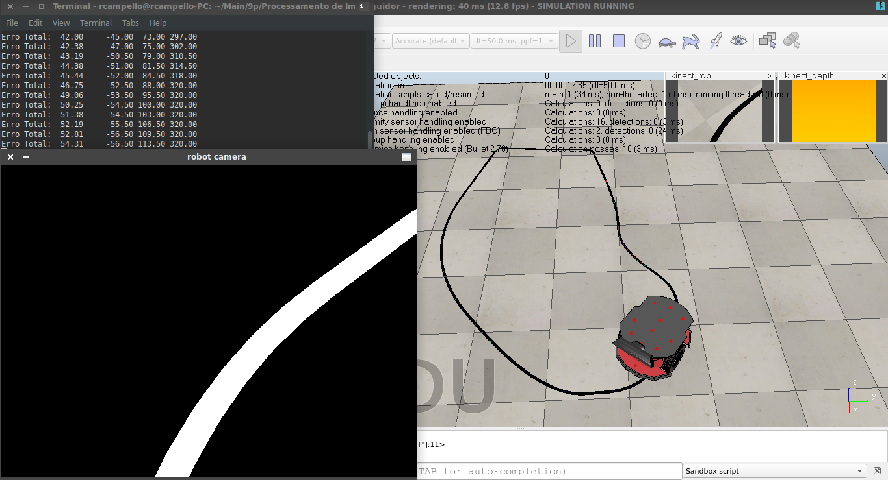 |  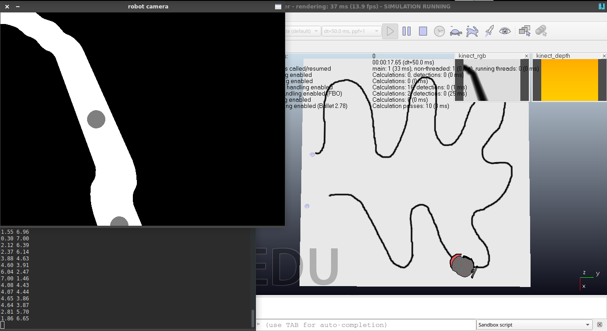 

##  
 Projeto 1: Mapeamento Projetivo 

Vídeos Projetados em 3 regiões ajustáveis|
:-------------------------:|
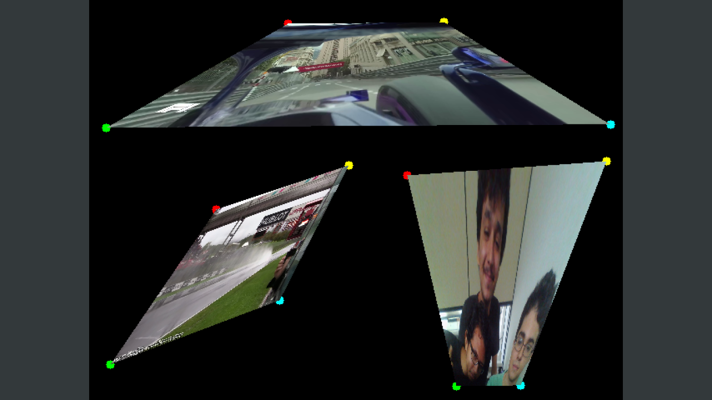 |  