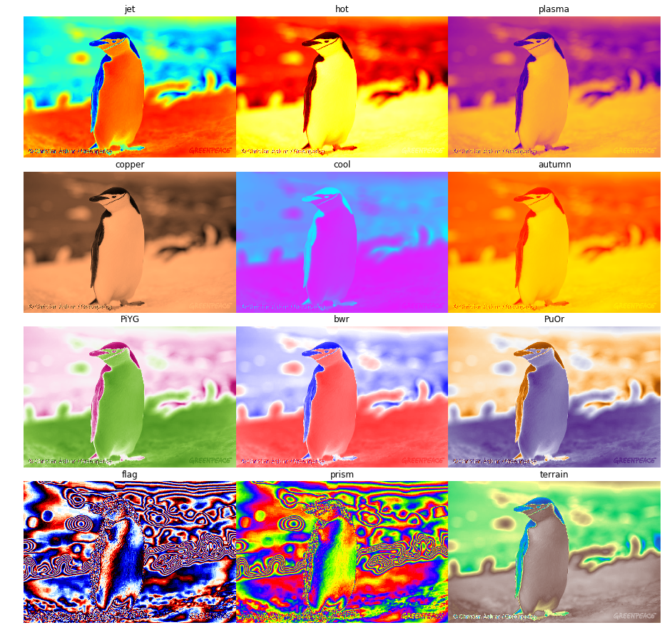

Projetos
=============================

##  
 Projeto 0: Simulador Robô Seguidor de Linha 

Versão Inicial | Com Timer 
:-------------------------:|:-------------------------:
 |   

##  
 Projeto 1: Mapeamento Projetivo 

Vídeos Projetados em 3 regiões ajustáveis|
:-------------------------:|
 |  

##  
 (Continuação) Projeto 1: Versão Tabuleiro de Xadrez 

Vídeo Projetado nas Casas Pretas 1 Frame por Vez|
:-------------------------:|
 |

##  
 Projeto 2: InPaint para Vídeos. 

Escolhendo Máscara | Máscara 
:-------------------------:|:-------------------------:
 |   

Original | InPainted 
:-------------------------:|:-------------------------:
 |   

# Aulas

## 
 <i> Quantização 
 

Antes             |  Depois
:-------------------------:|:-------------------------:
 |  

## 
 Filtros Espaciais 
 

Antes             |  Edges
:-------------------------:|:-------------------------:
 |   

Sharpening             |  Ruído
:-------------------------:|:-------------------------:
 |   

Median Blur             |  
:-------------------------:|
 |  

Histograma de Cores         |  
:-------------------------:|
 |  

Original             |  Canny Edge Detector
:-------------------------:|:-------------------------:
 |   

Original             |  Threshold
:-------------------------:|:-------------------------:
 |   

Original             |  Segmentation
:-------------------------:|:-------------------------:
 |   

Original             |  Segmentation
:-------------------------:|:-------------------------:
 |   

##  
 <i> Color Maps
1-Channel Images|
:-------------------------:|
 |

# 
 <i> Mapeamento Projetivo
Erode             |  Morph Gradient
:-------------------------:|:-------------------------:
 |   

Original minus Erode(plot cmap)|
:-------------------------:|
 |

Original             |  Skeleton
:-------------------------:|:-------------------------:
 |   

Transformada de Hough - Line|
:-------------------------:|
 |

Transformada de Hough - Círculo|
:-------------------------:|
 |

## 
 Face Swapping

Fonte 1             |  Fonte 2
:-------------------------:|:-------------------------:
 |   

Transformação 1            |  Transformação 2
:-------------------------:|:-------------------------:
 |   

Seamless Cloning|
:-------------------------:|
 |

Haar Face Detection|
:-------------------------:|
 |

## 
 Inpaint

Fonte           |  Segmentação para Inpaint
:-------------------------:|:-------------------------:
 |   

Fonte           |  Inpaint
:-------------------------:|:-------------------------:
 |   

## Redes Neurais: Resultados Variados(github: tadax/GLCIC)

Tentativa 1           |  Tentativa 2
:-------------------------:|:-------------------------:
 |   

Problemas. |
:-------------------------:|
 |

## Estenografia
<h5>Dada duas imagens, criar uma terceira que contenha os 4 bits mais significativos das 2 imagens de entrada. Depois "recuperar" as duas imagens a partir da terceira imagem.</h5>

Fonte 1          |  Fonte 2
:-------------------------:|:-------------------------:
 |  

<h3>Olhe essa imagem de baixo para cima! Perceba o Nemo embutido nessa imagem.</h3>

Imagem com Estenografia. |
:-------------------------:|
 |

Imagem Recuperada 1     |  Imagem Recuperada 1 
:-------------------------:|:-------------------------:
 |  
