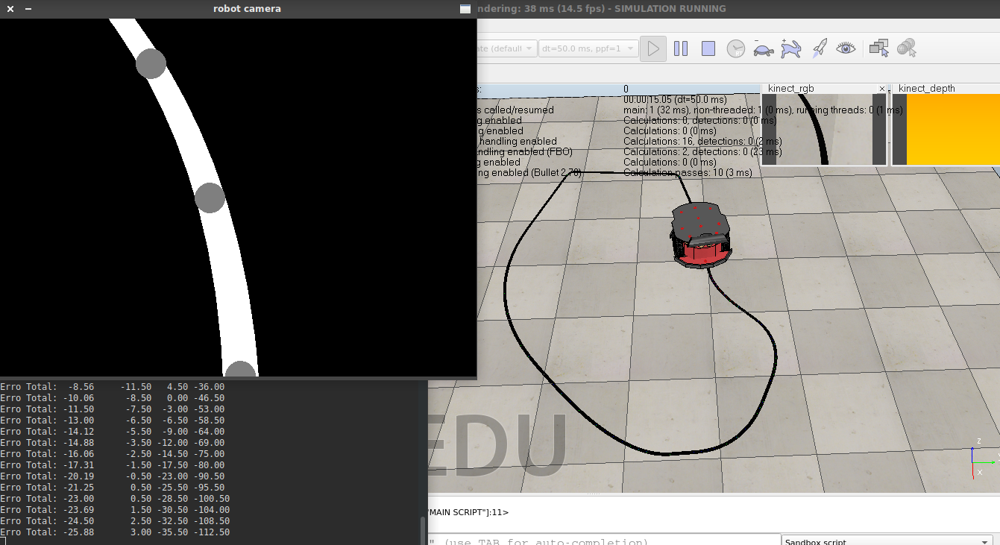

Aplicações
=============================

## 
 <i> Quantização 
 

Antes             |  Depois
:-------------------------:|:-------------------------:
 |  

## 
 Filtros Espaciais 
 

Antes             |  Edges
:-------------------------:|:-------------------------:
 |   

Sharpening             |  Ruído
:-------------------------:|:-------------------------:
 |   

Median Blur             |  
:-------------------------:|
 |  

Histograma de Cores         |  
:-------------------------:|
 |  

Original             |  Canny Edge Detector
:-------------------------:|:-------------------------:
 |   

Original             |  Threshold
:-------------------------:|:-------------------------:
 |   

Original             |  Segmentation
:-------------------------:|:-------------------------:
 |   

Original             |  Segmentation
:-------------------------:|:-------------------------:
 |   

##  
 Projeto 0: Simulador Robô Seguidor de Linha 

Versão Inicial | Com Timer 
:-------------------------:|:-------------------------:
 |   

##  
 Projeto 1: Mapeamento Projetivo 

Vídeos Projetados em 3 regiões ajustáveis|
:-------------------------:|
 |  

##  
 (Continuação) Projeto 1: Versão Tabuleiro de Xadrez 

Vídeo Projetado nas Casas Pretas 1 Frame por Vez|
:-------------------------:|
 |

##  
 <i> Color Maps
1-Channel Images|
:-------------------------:|
 |

# 
 <i> Mapeamento Projetivo
Erode             |  Morph Gradient
:-------------------------:|:-------------------------:
 |   

Original minus Erode(plot cmap)|
:-------------------------:|
 |

Original             |  Skeleton
:-------------------------:|:-------------------------:
 |   

Transformada de Hough - Line|
:-------------------------:|
 |

Transformada de Hough - Círculo|
:-------------------------:|
 |

## 
 Face Swapping

Fonte 1             |  Fonte 2
:-------------------------:|:-------------------------:
 |   

Transformação 1            |  Transformação 2
:-------------------------:|:-------------------------:
 |   

Seamless Cloning|
:-------------------------:|
 |

Haar Face Detection|
:-------------------------:|
 |

## 
 Inpaint

Fonte           |  Segmentação para Inpaint
:-------------------------:|:-------------------------:
 |   

Fonte           |  Inpaint
:-------------------------:|:-------------------------:
 |   

## Redes Neurais: tentando fazer algo útil e falhando. (tadax/GLCIC)

Tentativa 1           |  Tentativa 2
:-------------------------:|:-------------------------:
 |   

Um dia normal para Redes Neurais. |
:-------------------------:|
 |

